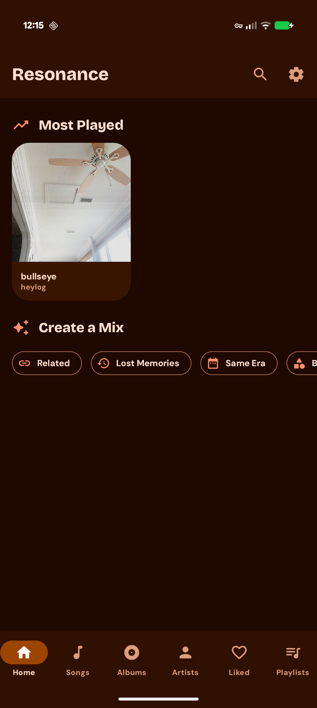
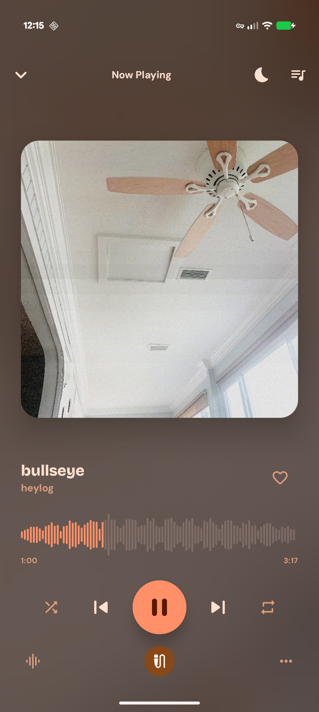
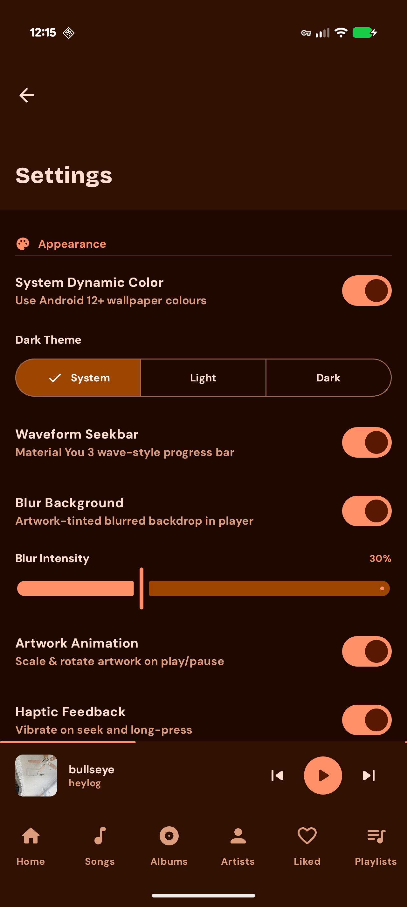
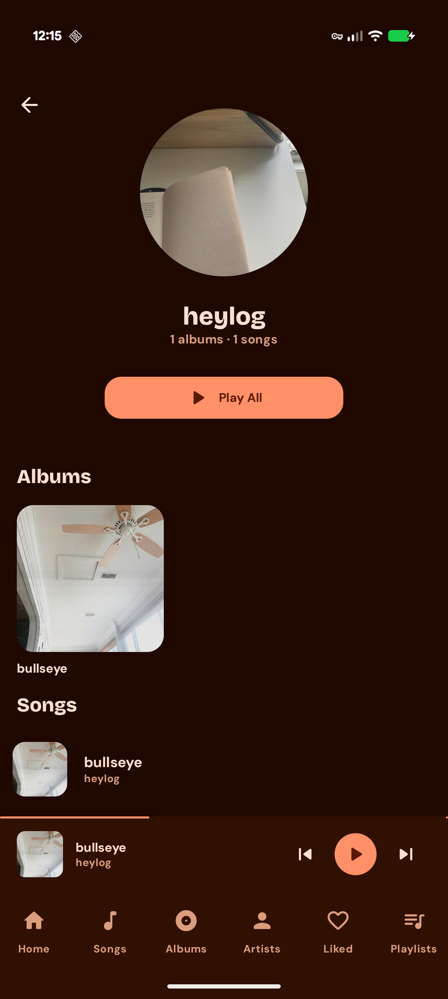
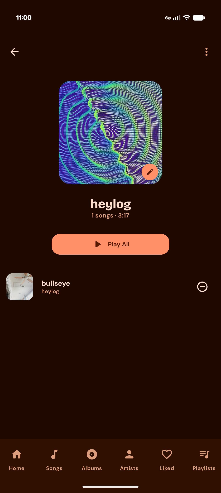
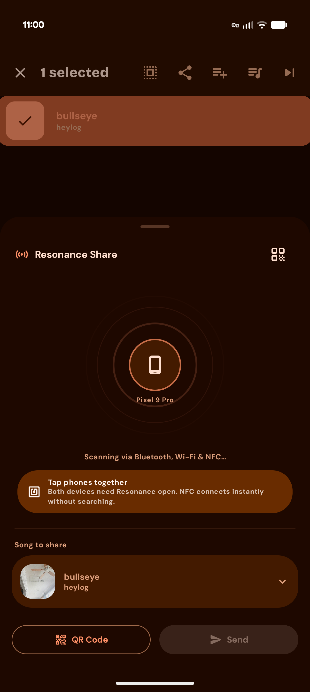
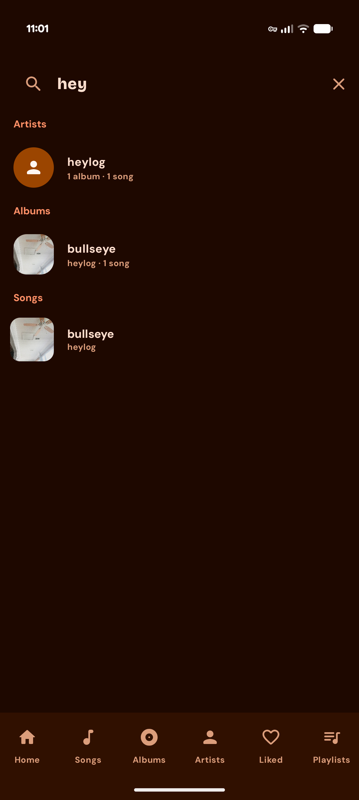
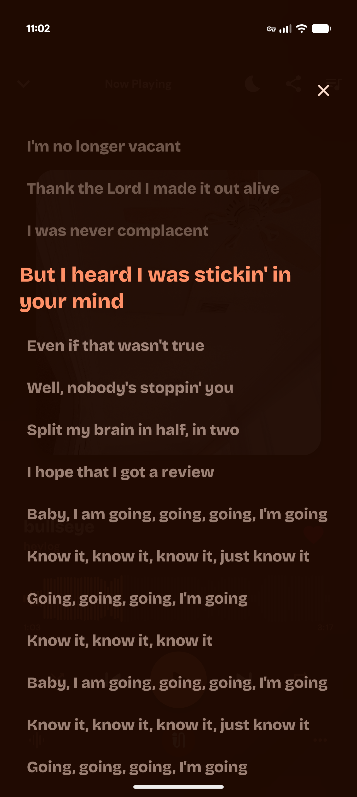

<div align="center">
  <h1>Resonance</h1>
  <p>A modern, feature-rich local music player for <b>Android 15 and newer</b></p>
  <p>Inspired by <a href="https://github.com/namidaco/namida">Namida</a>, <a href="https://github.com/theovilardo/PixelPlayer">Pixel Player</a> & <a href="https://github.com/FoedusProgramme/Gramophone">Gramphone</a> 💜</p>

  
  
  
  
</div>

---

## Overview

Resonance is a powerful local music player built entirely with Kotlin and Jetpack Compose. It is designed for audiophiles who want full control over their listening experience — from ReplayGain and crossfade to synced lyrics and Last.fm scrobbling, all without ads or subscriptions and completely FOSS forever.

## Screenshots

| Home tab | Player | Settings | Artist tab |
| :---: | :---: | :---: | :---: |
|  |  |  |  |

| Playlist | Resonance Share | Search | Lyrics |
| :---: | :---: | :---: | :---: |
|  |  |  |  |

## Features

### Playback
- [x] **Gapless playback** — seamless transitions between tracks using ExoPlayer's native gapless support
- [x] **Crossfade** — configurable crossfade duration between songs
- [x] **ReplayGain 2.0** — per-track and per-album volume normalization with configurable preamp
- [x] **Skip silence** — automatically skip silent passages
- [x] **Playback speed & pitch control** — independent speed and pitch adjustment
- [x] **Smart Shuffle** — history-aware shuffle that avoids repeating recently played tracks
- [x] **Sleep timer** — stop after a set number of tracks or minutes

### Library
- [x] **Full MediaStore integration** — automatically detects all local audio files
- [ ] **Configurable artist delimiters** — split multi-artist tags the way you want
- [ ] **Folder browsing** — navigate your music by directory
- [ ] **Excluded folders** — hide folders from the library
- [x] **Auto-scan** — scheduled background library refresh
- [x] **Sort & filter** — sort by title, artist, album, date added, duration, play count, and more
- [x] **Persistent queue** — queue survives app restarts

### Lyrics
- [x] **Synced lyrics** — LRC, TTML, and word-level karaoke support
- [x] **Embedded lyrics** — reads lyrics from ID3 tags
- [x] **LRCLib integration** — automatic online lyrics fetching
- [x] **Lyrics editor** — edit and save lyrics directly in the app

### Metadata & Artwork
- [ ] **Tag editor** — edit title, artist, album, genre, year, track number, and more
- [x] **Artwork fetching** — automatic album art from MediaStore and online sources
- [x] **Artist images** — artist photos fetched from the Deezer API
- [x] **Waveform seekbar** — real-time waveform visualization extracted from the audio file

### Last.fm
- [x] **Scrobbling** — automatic track scrobbling with configurable minimum listen threshold
- [x] **Now Playing** — real-time "now playing" updates
- [x] **Loved tracks** — sync liked songs with your Last.fm loved tracks

### UI & Customization
- [x] **Material 3** — full Material You dynamic color support
- [x] **Preset colors** — choose from a set of curated accent colors
- [x] **Dark / Light / System theme** — follows system or manual override
- [x] **Blur artwork background** — blurred album art as the player background
- [x] **Artwork animation** — rotating vinyl / artwork animation while playing
- [x] **Configurable corner radius** — round or sharp UI corners
- [x] **Mini player styles** — choose your preferred mini player layout
- [x] **Player layouts** — multiple full-screen player designs
- [x] **Haptic feedback** — tactile response on controls

### Home Screen Widget
- [x] **Now-playing widget** — displays the current song title and artist on your home screen
- [x] **Playback controls** — play/pause and skip directly from the widget
- [x] **Live updates** — widget stays in sync with the player in real time

## Tech Stack

| Layer | Technology |
|---|---|
| Language | Kotlin |
| UI | Jetpack Compose + Material 3 |
| Architecture | MVVM + Repository pattern |
| DI | Hilt |
| Media | Media3 / ExoPlayer + MediaSession |
| Widget | Jetpack Glance |
| Database | Room |
| Networking | Retrofit 2 + OkHttp + Moshi |
| Image loading | Coil |
| Preferences | DataStore |
| Background work | WorkManager |

## Getting Started

### Prerequisites

- Android Studio Hedgehog or newer
- Android SDK 35
- JDK 17

### Build

```bash
git clone https://github.com/YOUR_USERNAME/resonance.git
cd resonance
./gradlew assembleDebug
```

## Architecture

```
resonance/
├── data/
│   ├── database/       # Room entities, DAOs, database
│   ├── model/          # Domain models (Song, Album, Artist, Playlist…)
│   ├── network/        # Retrofit APIs (Last.fm, Deezer, LRCLib)
│   ├── preferences/    # DataStore preferences
│   ├── repository/     # Data repositories
│   └── service/        # MusicService (Media3 + ExoPlayer)
├── di/                 # Hilt modules
├── domain/
│   └── usecase/        # WaveformExtractor, ReplayGainProcessor, TagEditor, MediaSyncWorker
├── presentation/
│   ├── navigation/     # Compose NavGraph
│   ├── screens/        # Player, Library, Settings, Lyrics, Folders, Setup
│   ├── viewmodel/      # PlayerViewModel, LibraryViewModel, SettingsViewModel
│   └── components/     # Shared Compose components
└── ui/
    ├── glancewidget/   # Home screen widget
    └── theme/          # Material 3 theme, typography, colors
```

## Contributing

Contributions are welcome! Please open an issue first to discuss what you'd like to change.

1. Fork the repository
2. Create a feature branch (`git checkout -b feature/my-feature`)
3. Commit your changes (`git commit -m 'Add my feature'`)
4. Push the branch (`git push origin feature/my-feature`)
5. Open a Pull Request

## License

This project is licensed under the MIT License — see [LICENSE](LICENSE) for details.
